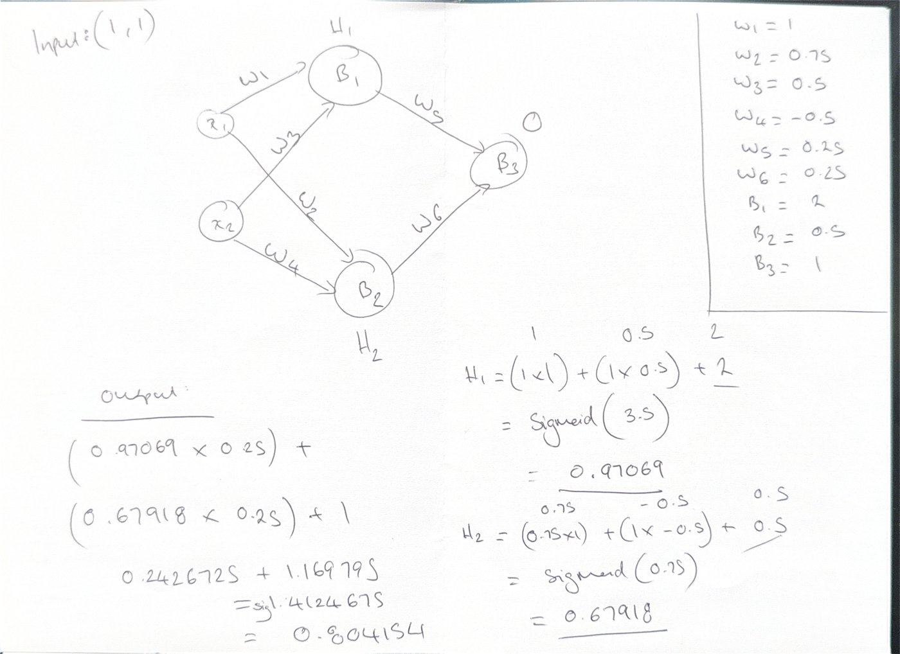

# Learning
Small python programs I've built while learning, mostly from scratch without libraries.

## Projects

### `cracker/word_guessing`
Two approaches to guessing a target word: 'brute_force.py' uses random letters until it matches and 'ga.py' which is a genetic algorithm that evolves towards the target. Uses fitness-weighted mating pool, crossover and mutation.

### `cracker/travelling_postman`
Travelling salesman problem solver using a genetic algorithm - highlighted the importance of preserving validity for permutations in crossover - standard gluing produces routes with duplicates or missing entities.

### `neural_net`
A 2-2-1 neural network written mostly from scratch and trained by a GA using neuroevolution rather than backprop to solve XOR. Converged at generation 563.

Forward pass verified by hand before training trusted - computed on paper & matched to 6dp.

## Running
Each project is a single file - run as standalone. 